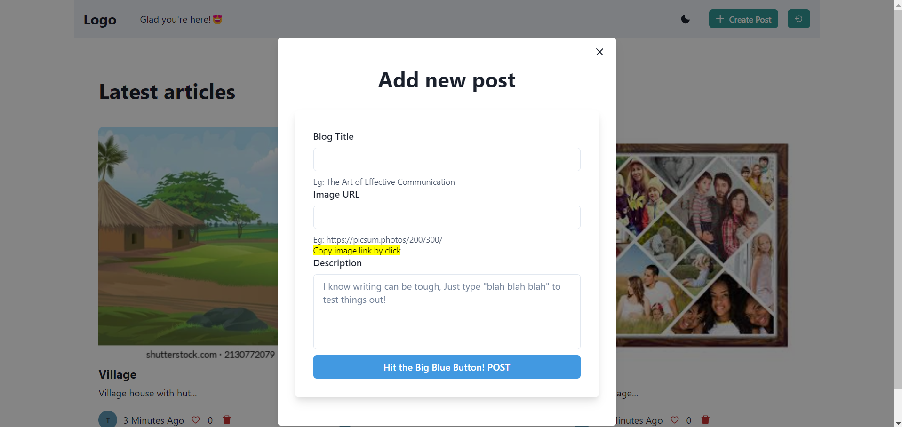

# Blog App with React JS

A blog application with React and Firebase as a backend

## Project Description

This is a React-based blog app that lets users create, like, and delete posts. The app has a responsive design and is built using modern web development techniques. It's a great project to learn how to build a full-stack web application with React and other cutting-edge technologies.

## Services

### Login

You can access posts without logging in, but you need to log in or create an account to create your own posts. If you would like to try out the feature, you can use the following user credentials:

testUser@mail.com
123456

### Register

Create a new user by entering email, username, and password.

### Home

Upon logging in or registering, users will be directed to the homepage, where they can browse all posts created by other users and create their own posts, along with their titles, descriptions, and images.

Make a single Blog Page to read the full blog.

### New post

By clicking on the 'Add Post' button, users can access a modal to create a new post with a title, description, image URL, and content.

### Others

- Only owner of the post see <b>Delete</b> button
- Logout button
- Guest users view the content

## Setting up the project

To run this project, you need to create a keys.js file in the root directory of the project and add your Firebase API key to it.

1. Create a file named keys.js in the root directory of the project.
2. Open the keys.js file and add the following code:

   export const apiKey = "YOUR_FIREBASE_API_KEY"

3. Replace YOUR_FIREBASE_API_KEY with your actual Firebase API key.
4. Save the keys.js file.

Once you have created the keys.js file and added your Firebase API key to it, you can run the project.

## Here are some common commands

1. npm install: Installs all the dependencies required for the project.
2. npm run dev: Runs the app in development mode.
3. npm run build: Builds the app for production to the build folder.

